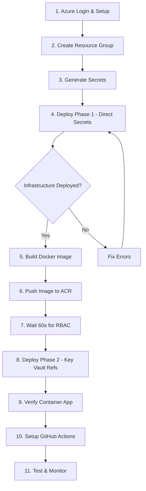

# Fresh Deployment Guide - MagicToolbox

Complete step-by-step guide for deploying MagicToolbox from scratch, including all prerequisites and dependencies.

## Table of Contents

- [Overview](#overview)
- [Prerequisites](#prerequisites)
- [Deployment Order](#deployment-order)
- [Step-by-Step Instructions](#step-by-step-instructions)
- [GitHub Actions Setup](#github-actions-setup)
- [Verification](#verification)
- [Troubleshooting](#troubleshooting)

---

## Overview

This guide walks you through deploying MagicToolbox from a completely clean slate, handling all dependencies and prerequisites in the correct order.

### Why Order Matters

The deployment has a **critical dependency chain**:

```
1. Azure Infrastructure - Phase 1 (Direct Secrets)
   ├── Creates Azure Container Registry (ACR)
   ├── Creates PostgreSQL, Redis, Storage, Key Vault
   ├── Creates Container Apps with Managed Identity (but FAILS)
   │   └── ❌ Cannot pull image - doesn't exist yet!
   └── Grants RBAC: Managed Identity → Key Vault Secrets User

2. Docker Image Build & Push
   ├── Build application Docker image
   ├── Push to ACR (now available from step 1)
   └── ✅ Image available for Container Apps

3. Redeploy Infrastructure - Phase 2 (Key Vault References)
   ├── Wait 60s for RBAC propagation
   ├── Update Container App secrets to use Key Vault URLs
   └── ✅ Container Apps succeeds - image exists + Key Vault access works
```

**Key Point**: You must build and push the Docker image BEFORE the Container App can successfully start.

---

## Prerequisites

### Required Tools

1. **Azure CLI** (v2.50+)
   ```bash
   # Linux
   curl -sL https://aka.ms/InstallAzureCLIDeb | sudo bash
   
   # Verify
   az --version
   ```

2. **Docker** (v20.10+)
   ```bash
   # Install Docker Engine
   curl -fsSL https://get.docker.com -o get-docker.sh
   sudo sh get-docker.sh
   
   # Add user to docker group (logout/login after)
   sudo usermod -aG docker $USER
   
   # Verify
   docker --version
   ```

3. **Git**
   ```bash
   sudo apt-get install git
   git --version
   ```

4. **Python 3.11+** (for secret generation)
   ```bash
   python3 --version
   ```

### Azure Requirements

- Active Azure subscription
- Permissions to create:
  - Resource Groups
  - Container Apps
  - Container Registry
  - PostgreSQL Flexible Server
  - Redis Cache
  - Storage Accounts
  - Key Vault
  - Log Analytics / Application Insights

### Repository Access

- GitHub account
- Repository cloned locally
- GitHub Actions enabled

---

## Deployment Order

Follow this **exact order** to avoid dependency issues:



### Why This Order?

1. **Phase 1 Deploy (Direct Secrets)** - Creates ACR, Key Vault, RBAC but Container App fails (no image)
2. **Build & Push Image** - Uses ACR credentials from step 1
3. **Wait for RBAC Propagation** - Azure AD needs time to propagate permissions (60 seconds)
4. **Phase 2 Deploy (Key Vault Refs)** - Updates Container App to use Key Vault, succeeds (image exists + permissions ready)

---

## Step-by-Step Instructions

### Step 1: Azure Login & Subscription Setup

```bash
# Login to Azure
az login

# List subscriptions
az account list --output table

# Set active subscription
az account set --subscription "Your Subscription Name or ID"

# Verify
az account show --output table
```

### Step 2: Create Resource Group

```bash
# Development environment
az group create \
  --name rg-westeurope-magictoolbox-dev-01 \
  --location westeurope

# Production environment (optional, for later)
az group create \
  --name rg-westeurope-magictoolbox-prod-01 \
  --location westeurope

# Verify
az group list --query "[?name contains 'magictoolbox']" --output table
```

### Step 3: Generate Secrets

Generate secure secrets for your deployment:

```bash
cd /path/to/magictoolbox

# Django Secret Key (67 characters, URL-safe)
DJANGO_SECRET_KEY=$(python3 -c "import secrets; print(secrets.token_urlsafe(50))")
echo "Django Secret: ${#DJANGO_SECRET_KEY} characters"

# PostgreSQL Admin Password (43 characters, URL-safe)
POSTGRES_ADMIN_PASSWORD=$(python3 -c "import secrets; print(secrets.token_urlsafe(32))")
echo "Postgres Password: ${#POSTGRES_ADMIN_PASSWORD} characters"

# Display (save these somewhere secure!)
echo ""
echo "=== SAVE THESE SECRETS ==="
echo "DJANGO_SECRET_KEY=$DJANGO_SECRET_KEY"
echo "POSTGRES_ADMIN_PASSWORD=$POSTGRES_ADMIN_PASSWORD"
echo "=========================="
```

**⚠️ IMPORTANT**: Save these secrets securely! You'll need them for:
- This deployment
- Future redeployments
- GitHub Actions secrets

### Step 4: Deploy Infrastructure - Phase 1 (Direct Secrets)

**Purpose**: Create all infrastructure with direct secrets. This creates the Managed Identity and grants RBAC permissions.

```bash
cd /path/to/magictoolbox

# Validate Bicep templates first
az bicep build --file infra/main.bicep

# Deploy infrastructure with direct secrets (Phase 1)
az deployment group create \
  --resource-group rg-westeurope-magictoolbox-dev-01 \
  --template-file infra/main.bicep \
  --parameters environment=dev \
               location=westeurope \
               appName=magictoolbox \
               postgresAdminUsername=magictoolbox \
               postgresAdminPassword="$POSTGRES_ADMIN_PASSWORD" \
               djangoSecretKey="$DJANGO_SECRET_KEY" \
               useKeyVaultReferences=false \
  --query "{provisioningState: properties.provisioningState, duration: properties.duration}" \
  -o json
```

**Deployment time**: ~10-20 minutes (PostgreSQL takes longest)

**Expected output**:
```json
{
  "duration": "PT15M30S",
  "provisioningState": "Failed"
}
```

This is **expected** - the Container App fails because the Docker image doesn't exist yet.

**Check deployment status**:

```bash
# Check deployment operations
az deployment operation group list \
  --resource-group rg-westeurope-magictoolbox-dev-01 \
  --name main \
  --query "[?properties.provisioningState=='Failed'].{target: properties.targetResource.resourceName, error: properties.statusMessage.error.code}" \
  -o table

# Should show Container App failed with: ContainerAppOperationError
# Error message: "MANIFEST_UNKNOWN: manifest tagged by 'develop' is not found"
```

**✅ This is correct!** The Container App can't pull the image because it doesn't exist yet.

**Verify other resources created**:

```bash
az resource list \
  --resource-group rg-westeurope-magictoolbox-dev-01 \
  --query "[].{name: name, type: type}" \
  -o table

# Should see:
# - Container Registry (ACR)
# - PostgreSQL Server
# - Redis Cache
# - Storage Account
# - Key Vault (with secrets stored)
# - Log Analytics
# - Application Insights
# - Container Apps Environment
# - Container App (failed state)
# - Role Assignments (RBAC for Key Vault access)
```

### Step 5: Build Docker Image

Now build the Docker image with the updated code:

```bash
cd /path/to/magictoolbox

# Get ACR login server from deployment (or use the known naming convention)
ACR_LOGIN_SERVER=$(az deployment group show \
  --resource-group rg-westeurope-magictoolbox-dev-01 \
  --name main \
  --query "properties.outputs.acrLoginServer.value" -o tsv)

# If deployment output is empty, use the resource list
if [ -z "$ACR_LOGIN_SERVER" ]; then
  ACR_LOGIN_SERVER=$(az acr list \
    --resource-group rg-westeurope-magictoolbox-dev-01 \
    --query "[0].loginServer" -o tsv)
fi

echo "ACR Login Server: $ACR_LOGIN_SERVER"

# Extract ACR name (remove .azurecr.io)
ACR_NAME=$(echo $ACR_LOGIN_SERVER | cut -d'.' -f1)
echo "ACR Name: $ACR_NAME"

# Build Docker image
docker build \
  -t ${ACR_LOGIN_SERVER}/magictoolbox:develop \
  --build-arg BUILD_DATE="$(date -u +'%Y-%m-%dT%H:%M:%SZ')" \
  --build-arg VCS_REF="$(git rev-parse --short HEAD)" \
  --build-arg BUILD_VERSION="develop-$(git rev-parse --short HEAD)" \
  .

# Verify image built
docker images | grep magictoolbox
```

**Build time**: ~2-5 minutes (first build)

### Step 6: Push Image to ACR

```bash
# Login to ACR
az acr login --name $ACR_NAME

# Push image
docker push ${ACR_LOGIN_SERVER}/magictoolbox:develop

# Verify image in registry
az acr repository show \
  --name $ACR_NAME \
  --image magictoolbox:develop \
  --query "{name: name, tag: 'develop', createdTime: createdTime}" \
  -o json
```

**Push time**: ~1-3 minutes (depending on network)

**✅ Checkpoint**: Image now exists in ACR!

### Step 7: Redeploy Infrastructure - Phase 2 (Key Vault References)

Now redeploy with Key Vault references enabled. First, wait for RBAC propagation:

```bash
cd /path/to/magictoolbox

# Wait for RBAC permissions to propagate (important!)
echo "⏳ Waiting 60 seconds for RBAC propagation..."
sleep 60

# Redeploy with Key Vault references enabled (Phase 2)
az deployment group create \
  --resource-group rg-westeurope-magictoolbox-dev-01 \
  --template-file infra/main.bicep \
  --parameters environment=dev \
               location=westeurope \
               appName=magictoolbox \
               postgresAdminUsername=magictoolbox \
               postgresAdminPassword="$POSTGRES_ADMIN_PASSWORD" \
               djangoSecretKey="$DJANGO_SECRET_KEY" \
               useKeyVaultReferences=true \
  --query "{provisioningState: properties.provisioningState, duration: properties.duration}" \
  -o json
```

**Expected output**:
```json
{
  "duration": "PT2M45S",
  "provisioningState": "Succeeded"
}
```

**✅ Success!** Deployment now completes successfully (~3 minutes - much faster than initial).

### Step 8: Verify Container App

```bash
# Check Container App status
az containerapp show \
  --name app-we-magictoolbox-dev-01 \
  --resource-group rg-westeurope-magictoolbox-dev-01 \
  --query "{name: name, provisioningState: properties.provisioningState, runningStatus: properties.runningStatus, fqdn: properties.configuration.ingress.fqdn}" \
  -o json
```

**Expected output**:
```json
{
  "name": "app-we-magictoolbox-dev-01",
  "provisioningState": "Succeeded",
  "runningStatus": "Running",
  "fqdn": "app-we-magictoolbox-dev-01.nicetree-xxxxx.westeurope.azurecontainerapps.io"
}
```

**Test the application**:

```bash
# Get FQDN
APP_URL=$(az containerapp show \
  --name app-we-magictoolbox-dev-01 \
  --resource-group rg-westeurope-magictoolbox-dev-01 \
  --query "properties.configuration.ingress.fqdn" -o tsv)

# Test health endpoint
curl -s "https://${APP_URL}/health/" && echo ""

# Should return: {"status": "healthy"}

# Test homepage
curl -s -o /dev/null -w "Homepage: %{http_code}\n" "https://${APP_URL}/"

# Should return: Homepage: 200
```

**Check logs** (wait 30 seconds for startup):

```bash
az containerapp logs show \
  --name app-we-magictoolbox-dev-01 \
  --resource-group rg-westeurope-magictoolbox-dev-01 \
  --follow false \
  --tail 50
```

Look for:
- ✅ `Starting gunicorn`
- ✅ `Listening at: http://0.0.0.0:8000`
- ✅ `GET /health/ HTTP/1.1" 200`
- ❌ `Waiting for database...` (should NOT see this)

### Step 9: Setup GitHub Actions (Optional but Recommended)

For automated deployments on push:

#### 9.1: Create Azure Service Principal

```bash
# Get subscription ID
SUBSCRIPTION_ID=$(az account show --query id -o tsv)

# Create service principal for GitHub Actions
az ad sp create-for-rbac \
  --name "magictoolbox-github-actions-dev" \
  --role Contributor \
  --scopes /subscriptions/${SUBSCRIPTION_ID}/resourceGroups/rg-westeurope-magictoolbox-dev-01 \
  --sdk-auth

# Save the JSON output - you'll need it for GitHub secrets
```

**Save this JSON output** - example:
```json
{
  "clientId": "xxxxx",
  "clientSecret": "xxxxx",
  "subscriptionId": "xxxxx",
  "tenantId": "xxxxx",
  ...
}
```

#### 9.2: Configure GitHub Secrets

Go to your GitHub repository:
- Settings → Secrets and variables → Actions → New repository secret

**Add these secrets**:

| Secret Name | Value | Source |
|------------|-------|--------|
| `AZURE_CREDENTIALS_DEV` | Full JSON from service principal | Step 9.1 output |
| `ACR_LOGIN_SERVER` | `<acrname>.azurecr.io` | From Step 5 |
| `ACR_NAME` | `<acrname>` | From Step 5 |
| `ACR_USERNAME` | From ACR credentials | See below |
| `ACR_PASSWORD` | From ACR credentials | See below |
| `RESOURCE_GROUP_DEV` | `rg-westeurope-magictoolbox-dev-01` | Fixed value |
| `CONTAINER_APP_NAME_DEV` | `app-we-magictoolbox-dev-01` | Fixed value |

**Get ACR credentials**:
```bash
az acr credential show --name $ACR_NAME --query "{username: username, password: passwords[0].value}" -o table
```

#### 9.3: Test GitHub Actions

```bash
# Commit the code change (KEY_VAULT_ENABLED fix)
git add magictoolbox/settings/production.py
git commit -m "fix: add KEY_VAULT_ENABLED flag to prevent unnecessary Key Vault access"

# Push to develop branch
git push origin develop

# This triggers: .github/workflows/azure-deploy.yml
# - Runs tests
# - Builds Docker image
# - Pushes to ACR
# - Deploys to Container Apps
```

Monitor workflow:
- Go to GitHub repository → Actions tab
- Watch the "Deploy to Azure Container Apps" workflow

### Step 10: Post-Deployment Tasks

#### Create Django Superuser

```bash
# Access container shell
az containerapp exec \
  --name app-we-magictoolbox-dev-01 \
  --resource-group rg-westeurope-magictoolbox-dev-01 \
  --command "/bin/bash"

# Inside container:
python manage.py createsuperuser
# Follow prompts
exit
```

#### Test Admin Access

```bash
# Open admin in browser
echo "https://${APP_URL}/admin/"
```

Login with superuser credentials created above.

#### Monitor Application

```bash
# View live logs
az containerapp logs show \
  --name app-we-magictoolbox-dev-01 \
  --resource-group rg-westeurope-magictoolbox-dev-01 \
  --follow

# Check Application Insights (in Azure Portal)
# Navigate to: Application Insights resource → Live Metrics
```

---

## GitHub Actions Setup

### Workflow Files

The repository includes these workflows:

1. **`.github/workflows/azure-deploy.yml`** - Main deployment workflow
   - Triggers: Push to `develop` or `main` branches
   - Steps: Test → Build → Push → Deploy

### Environment Configuration

Create GitHub Environments for deployment protection:

**Development Environment**:
- Name: `development`
- Protection: None (auto-deploy)

**Production Environment**:
- Name: `production`
- Protection: Required reviewers (add yourself)
- Deployment branch: `main` only

Go to: Settings → Environments → New environment

### Deployment Flow

```
Push to develop → GitHub Actions
  ├─→ Run tests (pytest, linting)
  ├─→ Build Docker image
  ├─→ Push to ACR
  └─→ Deploy to Container Apps (dev)

Push to main → GitHub Actions
  ├─→ Same as above
  └─→ Deploy to Container Apps (prod)
      └─→ Requires approval ✋
```

---

## Verification

### Complete Verification Checklist

Run through this checklist after deployment:

```bash
# 1. Infrastructure Status
az resource list \
  --resource-group rg-westeurope-magictoolbox-dev-01 \
  --query "length(@)"
# Expected: 10 resources

# 2. Container App Running
az containerapp show \
  --name app-we-magictoolbox-dev-01 \
  --resource-group rg-westeurope-magictoolbox-dev-01 \
  --query "properties.runningStatus" -o tsv
# Expected: Running

# 3. Health Endpoint
curl -s "https://${APP_URL}/health/" | jq
# Expected: {"status": "healthy"}

# 4. Homepage
curl -s -o /dev/null -w "%{http_code}\n" "https://${APP_URL}/"
# Expected: 200

# 5. Admin Redirect
curl -s -o /dev/null -w "%{http_code}\n" "https://${APP_URL}/admin/"
# Expected: 302

# 6. Database Connection
az containerapp logs show \
  --name app-we-magictoolbox-dev-01 \
  --resource-group rg-westeurope-magictoolbox-dev-01 \
  --tail 50 | grep -i "database\|gunicorn"
# Expected: See "Starting gunicorn", NO "Waiting for database" errors

# 7. Tools Registered
az containerapp logs show \
  --name app-we-magictoolbox-dev-01 \
  --resource-group rg-westeurope-magictoolbox-dev-01 \
  --tail 100 | grep "Registered tool"
# Expected: 5 tools registered
```

**All checks passed?** ✅ Deployment successful!

---

## Troubleshooting

### Issue 1: Container App Fails - "MANIFEST_UNKNOWN"

**Error**:
```
MANIFEST_UNKNOWN: manifest tagged by "develop" is not found
```

**Cause**: Docker image doesn't exist in ACR yet.

**Solution**: This is **expected** on first deployment. Follow Step 5 & 6 to build and push the image, then redeploy (Step 7).

---

### Issue 2: Container App Stuck "Waiting for database"

**Symptoms**:
```bash
az containerapp logs show ... | grep "attempt"
# Shows: "Waiting for database... (attempt 1/30)"
```

**Cause**: Database password mismatch between Container App and PostgreSQL server.

**Diagnosis**:
```bash
# Check if DB_PASSWORD is set
az containerapp show \
  --name app-we-magictoolbox-dev-01 \
  --resource-group rg-westeurope-magictoolbox-dev-01 \
  --query "properties.template.containers[0].env[?name=='DB_PASSWORD'].{name: name, hasValue: value != null}" \
  -o table

# Should show: hasValue = True
```

**Solution**: Redeploy infrastructure with correct secrets (Step 7).

---

### Issue 3: Key Vault Permission Errors

**Error in logs**:
```
Code: Forbidden
Message: Caller is not authorized to perform action on resource
Action: 'Microsoft.KeyVault/vaults/secrets/getSecret/action'
```

**Cause**: Application code trying to access Key Vault, but Managed Identity lacks permissions (or Key Vault access not needed).

**Solution**: Already fixed in code with `KEY_VAULT_ENABLED` flag. Rebuild Docker image (Step 5) and redeploy (Step 7).

---

### Issue 4: "Invalid HTTP_HOST header"

**Error**:
```
Invalid HTTP_HOST header: '100.100.x.x:8000'
```

**Cause**: Azure health probes using internal IPs not in `ALLOWED_HOSTS`.

**Solution**: Already fixed via `HealthCheckMiddleware` in codebase. No action needed.

---

### Issue 5: Static Files Return 404

**Symptoms**: CSS/JS files not loading, console shows 404 errors.

**Cause**: Static files not collected during container startup.

**Diagnosis**:
```bash
az containerapp logs show ... | grep "collectstatic"
# Should see: "Collecting static files..."
```

**Solution**: Already handled in `scripts/startup.sh`. If missing, check container startup logs.

---

### Issue 6: ACR Login Fails

**Error**:
```bash
az acr login --name $ACR_NAME
# Error: unauthorized: authentication required
```

**Solution**:
```bash
# Check if logged into Azure
az account show

# Re-login if needed
az login

# Verify ACR exists
az acr show --name $ACR_NAME --query "{name: name, loginServer: loginServer}" -o table
```

---

### Issue 7: Deployment Takes Too Long

**Symptoms**: Infrastructure deployment stuck for 20+ minutes.

**Check**:
```bash
# Check deployment progress
az deployment group show \
  --resource-group rg-westeurope-magictoolbox-dev-01 \
  --name main \
  --query "properties.provisioningState" -o tsv

# Check what's running
az deployment operation group list \
  --resource-group rg-westeurope-magictoolbox-dev-01 \
  --name main \
  --query "[?properties.provisioningState=='Running'].{resource: properties.targetResource.resourceName, duration: properties.duration}" \
  -o table
```

**Common causes**:
- PostgreSQL creation (takes 10-15 minutes - normal)
- Container App waiting for image (expected on first deploy)

**Solution**: Be patient. PostgreSQL takes longest. Container App will fail first time (expected).

---

## Quick Reference Commands

### Deployment
```bash
# Full fresh deployment (after Steps 1-3)
az deployment group create \
  --resource-group rg-westeurope-magictoolbox-dev-01 \
  --template-file infra/main.bicep \
  --parameters environment=dev location=westeurope appName=magictoolbox \
               postgresAdminUsername=magictoolbox \
               postgresAdminPassword="$POSTGRES_PASSWORD" \
               djangoSecretKey="$DJANGO_SECRET"
```

### Build & Push
```bash
# Build and push Docker image
ACR_NAME="your-acr-name"
docker build -t ${ACR_NAME}.azurecr.io/magictoolbox:develop .
az acr login --name $ACR_NAME
docker push ${ACR_NAME}.azurecr.io/magictoolbox:develop
```

### Monitoring
```bash
# View logs
az containerapp logs show \
  --name app-we-magictoolbox-dev-01 \
  --resource-group rg-westeurope-magictoolbox-dev-01 \
  --follow

# Check status
az containerapp show \
  --name app-we-magictoolbox-dev-01 \
  --resource-group rg-westeurope-magictoolbox-dev-01 \
  --query "properties.runningStatus"
```

---

## Summary: Complete Fresh Deployment

**Time required**: ~35-45 minutes (first time)

**Steps**:
1. ✅ Azure login (2 min)
2. ✅ Create resource group (1 min)
3. ✅ Generate secrets (1 min)
4. ✅ Deploy Phase 1 (direct secrets) - Container App fails (15-20 min)
5. ✅ Build Docker image (3-5 min)
6. ✅ Push to ACR (2-3 min)
7. ✅ Wait for RBAC propagation (1 min)
8. ✅ Deploy Phase 2 (Key Vault refs) - succeeds (3 min)
9. ✅ Verify deployment (5 min)
10. ✅ Setup GitHub Actions (10 min)
11. ✅ Create superuser & test (5 min)

**Key Dependencies**:
- ACR must exist before building image → ✅ Created in Step 4
- Image must exist before Container App succeeds → ✅ Pushed in Step 6
- RBAC must propagate before Key Vault access → ✅ 60s wait in Step 7
- Key Vault references only work after RBAC is ready → ✅ Phase 2 in Step 8

---

## Related Documentation

- **[DEPLOYMENT.md](DEPLOYMENT.md)** - Detailed deployment guide with all options
- **[AZURE_DEPLOYMENT_README.md](AZURE_DEPLOYMENT_README.md)** - Quick deployment overview
- **[GITHUB_SECRETS_QUICK_REFERENCE.md](GITHUB_SECRETS_QUICK_REFERENCE.md)** - GitHub secrets checklist
- **[QUICK_REFERENCE.md](QUICK_REFERENCE.md)** - Command reference

---

**Last Updated**: November 30, 2025  
**Tested**: Azure CLI 2.66+, Docker 27+, Python 3.11+
